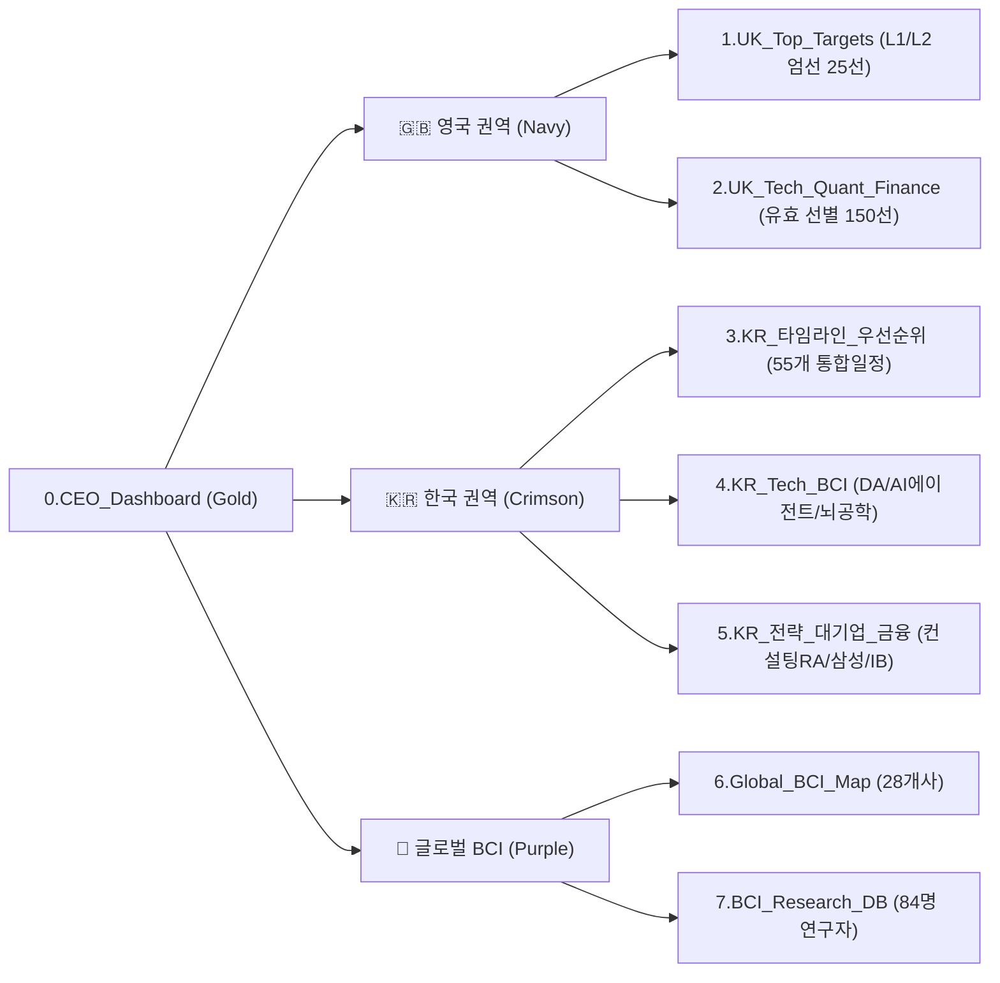

# 🎯 2027 Global Internship & Career Executive Dashboard

> **Central Control Tower for Penultimate Year (Class of 2028) Opportunities**  
> UCL BSc Psychology and Language Sciences | Product Design (HCI) · Data Science & AI · BCI & Neurotech · SWE · Strategy

---

## 🧭 Executive Architecture & Tab Structure



---

## 📌 Candidate Ground Truth Baseline

| Field | Ground Truth Value | Note |
| :--- | :--- | :--- |
| **Candidate** | **Kyubin Yun (윤규빈)** | UCL Penultimate Year (Class of 2028) |
| **Institution** | **University College London (UCL)** | London, United Kingdom |
| **Degree & Major** | **BSc Psychology and Language Sciences** | Focus: Cognitive Science, HCI, Computational Modeling |
| **Work Authorization**| **UK Student Route Visa** (Full-Time Summer Work Permitted) | 2-Year Unsponsored Graduate Route Eligible |
| **Core Target Roles** | Product Design / HCI, Data Analytics / Applied AI, BCI / Neurotech, Forward Deployed SWE, Strategy Consulting | High synergy with cognitive science & quantitative data analysis |

---

## 🗂️ 4 Strategic Career Tracks Overview

### [TRACK-A] Global BCI & Neurotech
- **Target Scope**: 28 Tier-1 Global BCI & Neurotechnology enterprises (Apple, Google, Meta Reality Labs, Neuralink, Synchron, Paradromics).
- **Researcher Network**: 84 verified principal investigators and lead scientists for cold-outreach & academic collaboration.
- **Reference**: `1.Global_BCI_Map` / `2.Research_Database`

### [TRACK-B] UK 2027 Summer Tech & Finance
- **Target Scope**: Curated L1/L2 top-tier internships in London & UK.
- **Key Targets**:
  - **Palantir Technologies**: *Product Designer, Internship* & *Forward Deployed Software Engineer (FDSE) Intern*
  - **Tower Research Capital & Jump Trading**: *Quant Trading / ML Research Engineer*
  - **Man Group**: *People Analytics & AI Transformation Analyst*
  - **American Express & Bain & Company**: *AI Engineering Intern*
- **Noise Elimination**: Excluded 350+ irrelevant positions (Audit, Tax, Accounting, Actuarial, Pensions, Insurance, Real Estate, general IT helpdesk).
- **Reference**: `4.UK_Target_Master` / `UK_Top_Targets`

### [TRACK-C] Korea High-Impact Careers 2026–2027
- **Target Scope**: 55 rigorously verified high-impact opportunities across 6 key sectors:
  1. Top BCI & EEG Labs (KAIST, Korea University, SNU)
  2. Tech Data Science & Product Analytics (Daangn, Toss)
  3. AI Agent & LLM Startups (Naver AI, Wrtn, etc.)
  4. Global Strategy Consulting RA (Bain ACT, McKinsey, BCG)
  5. Conglomerates Global Internship (Samsung Electronics DX/DS Overseas University Summer)
  6. Foreign Investment Banking & Quant
- **Reference**: `7.KR_통합일정_타임라인` / `8.KR_종합요약_우선순위`

### [TRACK-D] Data Science Roadmap & Technical Prep
- **Focus**: End-to-end Machine Learning mastery, Python for Data Science, LeetCode / Online Assessment (OA) / SJT preparation.
- **Reference**: `03_Data_Science_Roadmap`

---

## 🛡️ Core Operating Directives & Safety Gates

1. **Zero Auto-Submit (최종 제출 버튼 자동 클릭 절대 금지)**:
   - All automated application workflows stop strictly at the Review / Pre-submit stage. Final submission is always performed manually by the candidate.
2. **Visible Naver Whale Browser Protocol**:
   - Background headless browsers are strictly forbidden. All CDP automation runs interactively on user-visible Naver Whale browser instances (`localhost:9222`).
3. **Single Source of Truth (SSOT)**:
   - Master data is consolidated into [**`Master_Internship_Tracker_2027_SSOT.xlsx`**](./Master_Internship_Tracker_2027_SSOT.xlsx).
4. **Form Field Text Normalization Protocol**:
   - Raw bullet glyphs (`⚫`, `●`, `▪`) normalized to standard `• `, mid-sentence line breaks unwrapped, punctuation spacing cleaned.

---

## 🛠️ Repository & Workspace Structure

```text
04_Internship/
├── Master_Internship_Tracker_2027_SSOT.xlsx   # Single Source of Truth Master Workbook
├── README.md                                   # Executive Dashboard Architecture
├── read.md                                     # Markdown Mirror
├── 00_CEO_Control_Tower/                       # CEO Orchestration Hub & Session Registry
│   ├── CEO_ORCHESTRATION_HUB.md               # Main Dashboard
│   ├── CHATROOM_REGISTRY.json                 # Machine-Readable Session Registry
│   ├── HANDOFF_PROTOCOLS.md                   # Child Room Dispatch Protocols
│   ├── reports/                               # Deep-Dive Research Reports
│   └── sessions/                              # Briefs & Completion Dossiers
├── 01_Resumes/                                # Resumes, Cover Letters, Portfolios
├── 02_Interview_Prep/                         # Behavioral & Technical Prep Docs
├── 03_Data_Science_Roadmap/                   # ML & Python DS Learning Curricula
├── 2027_Summer2_Internship/                   # Subproject Source Code & Pipelines
├── Backups/                                   # Historical Backups Archive
├── data/                                      # Source Trackers Archive
└── .agents/                                   # AI Agent Rules, Skills, and Directives
```

---

## 👑 CEO Control Tower CLI Guide

```bash
# 1. Check executive system status and track statistics
python .agents/skills/apply/scripts/ceo_hub.py status

# 2. List all registered child chatrooms
python .agents/skills/apply/scripts/ceo_hub.py list

# 3. Generate dispatch brief for a child session
python .agents/skills/apply/scripts/ceo_hub.py handoff --session-id ROOM-UK-PALANTIR-002

# 4. Reconcile completed child mission into Master SSOT
python .agents/skills/apply/scripts/ceo_hub.py sync-return --session-id ROOM-UK-PALANTIR-002 --status SUCCESS_REVIEW_READY --summary "Application reached Review page."

# 5. Re-compile and validate Master SSOT Excel
python .agents/skills/apply/scripts/ceo_hub.py build-ssot
```
