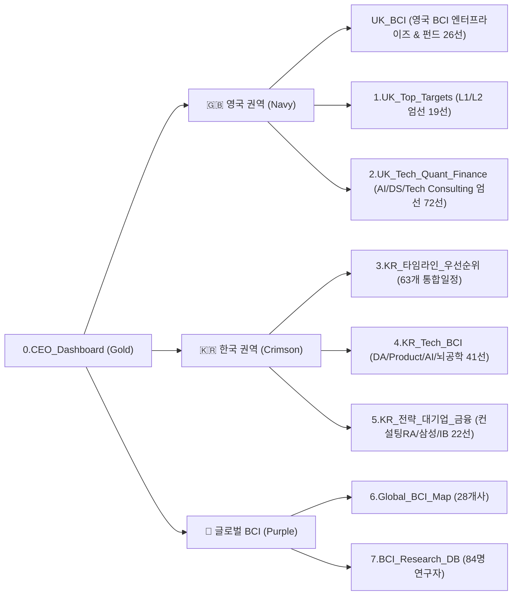

# 🎯 2027 Global Internship & Career Executive Dashboard

> **Central Control Tower for Penultimate Year (Class of 2028) Opportunities**  
> UCL BSc Psychology and Language Sciences | Product Design (HCI) · Data Science & AI · BCI & Neurotech · SWE · Strategy

---

## 🧭 Executive Architecture & 8-Tab Structure



---

## 📊 Master 9-Tab Architecture Overview

| Tab # | Sheet Name | Color Theme | Domain Scope | Record Count | Description & Navigation Purpose |
| :--- | :--- | :--- | :--- | :--- | :--- |
| **Tab 0** | **`0.CEO_Dashboard`** | 🟡 Gold (`#D4AF37`) | Executive Control | KPI Cards + Baseline | 전체 8개 서브시트 직결 하이퍼링크, 포트폴리오 요약 및 지원자 기준 데이터 |
| **Tab 1** | **`UK_BCI`** | 🔵 Navy (`#1F4E79`) | UK BCI & Neurotech | 26개사/기관 | 영국 BCI 엔터프라이즈 JV/CVC, 뉴로테크 펀드, 국책 연구기관, 핵심 스케일업 26선 (Galvani, Stanhope AI, MintNeuro, Amber Therapeutics 등) |
| **Tab 2** | **`1.UK_Top_Targets`** | 🔵 Navy (`#1F4E79`) | UK L1/L2 Priority | 19개 최우선 타깃 | Palantir(Product Design/FDSE), Tower Research, Man Group 등 공식포털 단독 발굴 (마감 공고 정제) |
| **Tab 3** | **`2.UK_Tech_Quant_Finance`** | 🔵 Navy (`#1F4E79`) | UK AI/ML, Data Science, Startups | 72개 엄선 프로그램 | SWE/Quant/노이즈 제거 후 AI/ML, Data Science, Tech Consulting/Startup 72선 엄선 |
| **Tab 4** | **`3.KR_타임라인_우선순위`** | 🔴 Crimson (`#C00000`) | Korea Career Master | 63개 고영향 기회 | 국내 6대 섹터 통합 타임라인, 자소설닷컴/공식포털 교차검증, 마감 일정 및 우선순위 정렬 |
| **Tab 5** | **`4.KR_Tech_BCI`** | 🔴 Crimson (`#C00000`) | Korea Tech / AI / BCI | 41개 기회 (3개 섹션) | DA/Product(19선) + AI Agent/LLM(11선) + EEG/BCI 뇌공학 연구실(KAIST 등 11선) 통합 (토스·네이버·카카오 신규 발굴 반영) |
| **Tab 6** | **`5.KR_전략_대기업_금융`** | 🔴 Crimson (`#C00000`) | Korea Strategy / IB | 22개 기회 (3개 섹션) | 전략컨설팅 RA(Bain/McK 11선) + 대기업 해외대(삼성 5선) + 외국계 IB(6선) 통합 |
| **Tab 7** | **`6.Global_BCI_Map`** | 🟣 Purple (`#7030A0`) | Global BCI Enterprise | 28개사 글로벌 맵 | Apple, Google, Meta, Neuralink 등 28개사 우선순위 맵 & 7번 시트 직결 링크 |
| **Tab 8** | **`7.BCI_Research_DB`** | 🟣 Purple (`#7030A0`) | BCI Research Contacts | 84명 핵심 연구자 | 기업별 연구 적합도, PI/Lead Scientist 컨택, 전략 훅 (텔레메트리 G~K 은닉) |

---

## 🧹 UK Trackr Noise Purging (노이즈 정제 기준)

사용자 직무 적합도(HCI / Cognitive Science, Data Science & AI, SWE, Quant, Strategy)와 무관한 직군 79개사를 전면 제거하여 데이터 밀도를 극대화했습니다:
- **영구 배제 카테고리**: `Pensions and Insurance`, `Accounting and Audit`, `Real Estate`, `Big 4`
- **배제 키워드**: `audit`, `tax`, `taxation`, `accounting`, `accountant`, `actuarial`, `actuary`, `pension`, `insurance`, `real estate`, `property`, `telecom`, `helpdesk`, `service desk`, `wealth planning`, `compliance`
- **보존 직군**: Software Engineering, AI & Machine Learning, Data Science, Quant Trading, Quant Developer, Tech Consulting, Bulge Bracket & Elite Boutique Investment Banking, Asset Management, Strategy Consulting

---

## 📌 Candidate Ground Truth Baseline

| Field | Ground Truth Value | Note |
| :--- | :--- | :--- |
| **Candidate** | **Kyubin Yun (윤규빈)** | UCL Penultimate Year (Class of 2028) |
| **Institution** | **University College London (UCL)** | London, United Kingdom |
| **Degree & Major** | **BSc Psychology and Language Sciences** | Focus: Cognitive Science, HCI, Computational Modeling |
| **Work Authorization**| **UK Student Route Visa** (Full-Time Summer Work Permitted) | 2-Year Unsponsored Graduate Route Eligible |
| **Academic Grade** | **Honours** (Achieved/Predicted: 70.5/100) | First Class Honours Range |
| **Official Email** | `zcjtyun@ucl.ac.uk` | UCL Academic ID for all portals |
| **Mobile Phone** | `+44 7787 442404` | UK Mobile (Country Code: `+44`) |
| **UK Address** | 40 Merchant St, Brent Cross, Suite 638, London, NW2 8BB | Current UK Residence |
| **Standard Password** | `Jeff0825!!` | General Portals (Greenhouse, Lever, etc.) |
| **Workday Password** | `Jeff0825!!!!` | Workday Exclusive (Mandatory 12+ characters) |
| **Core Target Roles** | Product Design / HCI, Data Analytics / Applied AI, BCI / Neurotech, Forward Deployed SWE, Strategy Consulting | High synergy with cognitive science & quantitative data analysis |

---

## 🗂️ 4 Strategic Career Tracks Overview

### [TRACK-A] Global BCI & Neurotech
- **Target Scope**: 28 Tier-1 Global BCI & Neurotechnology enterprises (Apple, Google, Meta Reality Labs, Neuralink, Synchron, Paradromics).
- **Researcher Network**: 84 verified principal investigators and lead scientists for cold-outreach & academic collaboration.
- **Reference**: `6.Global_BCI_Map` / `7.BCI_Research_DB`

### [TRACK-B] UK 2027 Summer Tech & Finance
- **Target Scope**: Curated L1/L2 top-tier internships in London & UK (91 total opportunities: 19 Top Targets + 72 Trackr AI/ML, Data Science, Tech Consulting & Startups).
- **Key Targets**:
  - **Palantir Technologies**: *Product Designer, Internship* & *Forward Deployed Software Engineer (FDSE) Intern*
  - **Tower Research Capital & Jump Trading**: *Quantitative Trader/Researcher Summer 2027*
  - **Man Group**: *2027 Quant Researcher Summer Internship*
  - **American Express**: *AI Engineer Internship Programme - 2027*
- **Noise, Expired & Non-Target Elimination**: Excluded 79 irrelevant noise positions (Audit, Tax, Accounting, Insurance 등), 18 expired positions, and non-target tracks (pure SWE & Quant trading/development), retaining 72 high-value AI/ML, Data Science, Tech Consulting, and Startup roles.
- **Reference**: `1.UK_Top_Targets` / `2.UK_Tech_Quant_Finance`

### [TRACK-C] Korea High-Impact Careers 2026–2027
- **Target Scope**: 63 rigorously verified high-impact opportunities across 6 key sectors:
  1. Top BCI & EEG Labs (KAIST, Korea University, SNU - 11 labs)
  2. Tech Data Science & Product Analytics / Design (Daangn, Toss, Naver, Kakao Pay - 19 positions)
  3. AI Agent & LLM Tech Giants & Startups (Naver, Kakao, DeepAuto, Wrtn, Daangn - 11 positions)
  4. Global Strategy Consulting RA (Bain ACT, McKinsey, BCG - 11 positions)
  5. Conglomerates Global Internship (Samsung Electronics DX/DS Overseas University Summer - 5 tracks)
  6. Foreign Investment Banking & Quant (Morgan Stanley, Goldman Sachs, UBS Seoul - 6 programs)
- **Reference**: `3.KR_타임라인_우선순위` / `4.KR_Tech_BCI` / `5.KR_전략_대기업_금융`

### [TRACK-D] Data Science Roadmap & Technical Prep
- **Focus**: End-to-end Machine Learning mastery, Python for Data Science, LeetCode / Online Assessment (OA) / SJT preparation.
- **Reference**: `03_Data_Science_Roadmap`

---

## 🛡️ Core Operating Directives & Safety Gates

1. **Zero Auto-Submit (최종 제출 버튼 자동 클릭 절대 금지)**:
   - All automated application workflows stop strictly at the Review / Pre-submit stage. Final submission is always performed manually by the candidate.
2. **Visible Naver Whale Browser Protocol**:
   - Background headless browsers are strictly forbidden. All CDP automation runs interactively on user-visible Naver Whale browser instances (`localhost:9222`).
3. **Single Source of Truth (SSOT)**:
   - Master data is consolidated into [**`Master_Internship_Tracker_2027_SSOT.xlsx`**](./Master_Internship_Tracker_2027_SSOT.xlsx).
4. **Form Field Text Normalization Protocol**:
   - Raw bullet glyphs (`⚫`, `●`, `▪`) normalized to standard `• `, mid-sentence line breaks unwrapped, punctuation spacing cleaned.

---

## 🛠️ Repository & Workspace Structure

```text
04_Internship/
├── Master_Internship_Tracker_2027_SSOT.xlsx   # Single Source of Truth Master Workbook (8 Tabs)
├── README.md                                   # Executive Dashboard Architecture
├── read.md                                     # Markdown Mirror
├── 00_CEO_Control_Tower/                       # CEO Orchestration Hub & Session Registry
│   ├── CEO_ORCHESTRATION_HUB.md               # Main Control Tower Dashboard
│   ├── CHATROOM_REGISTRY.json                 # Machine-Readable Session Registry
│   ├── HANDOFF_PROTOCOLS.md                   # Child Room Dispatch Protocols
│   ├── reports/                               # Deep-Dive Research Reports
│   └── sessions/                              # Briefs & Completion Dossiers
├── 01_Resumes/                                # Resumes, Cover Letters, Portfolios
├── 02_Interview_Prep/                         # Behavioral & Technical Prep Docs
├── 03_Data_Science_Roadmap/                   # ML & Python DS Learning Curricula
├── 2027_Summer2_Internship/                   # Subproject Source Code & Pipelines
├── Backups/                                   # Historical Backups Archive
├── data/                                      # Source Trackers Archive
└── .agents/                                   # AI Agent Rules, Skills, and Directives
```

---

## 👑 CEO Control Tower CLI Guide

```bash
# 1. Check executive system status and track statistics
python .agents/skills/apply/scripts/ceo_hub.py status

# 2. List all registered child chatrooms
python .agents/skills/apply/scripts/ceo_hub.py list

# 3. Generate dispatch brief for a child session
python .agents/skills/apply/scripts/ceo_hub.py handoff --session-id ROOM-UK-PALANTIR-002

# 4. Reconcile completed child mission into Master SSOT
python .agents/skills/apply/scripts/ceo_hub.py sync-return --session-id ROOM-UK-PALANTIR-002 --status SUCCESS_REVIEW_READY --summary "Application reached Review page."

# 5. Re-compile and validate Master SSOT Excel
python .agents/skills/apply/scripts/ceo_hub.py build-ssot
```
