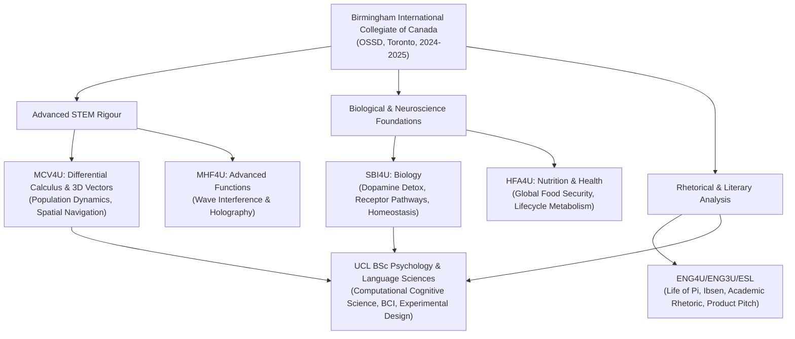

# BICC Ontario High School Academic Records & Ground Truth Extraction

## 1. Institutional Ground Truth & Overview
- **School Name**: Birmingham International Collegiate of Canada (BICC)
- **School Type**: Ministry of Education Inspected Private Secondary School
- **Location**: Toronto, Ontario, Canada
- **BSID**: 668875
- **Curriculum / Diploma**: Ontario Secondary School Diploma (OSSD)
- **Academic Stream**: University Preparation (U-level / Level 4 Courses)
- **Study Dates**: December 2024 – April 2025 (전체 학업 과정: 2024–2025)
- **Attendance Type & Mode**: Full time / In person
- **Certification Date**: 01/04/2025 (April 1, 2025)
- **Candidate Name**: Kyubin Yun (윤규빈)

### 1.1 Official Academic Module Transcript & Verified Grades

#### Grade 12 (4U) — UCL Admission Official Baseline (Top 6 Average: 93.33% / Best 6: 95.50%)
| Completion Date | Course Code | Course Title | Level | Official Final Grade | UCL Admission Role |
| :--- | :--- | :--- | :--- | :--- | :--- |
| **01/11/2024** | **SBI4U** | **Biology** | Grade 12 | **96%** | Core UCL Science Requirement |
| **01/03/2024** | **HSB4U** | **Challenge and Change in Society** | Grade 12 | **96%** | Social & Behavioral Sciences |
| **01/06/2024** | **MHF4U** | **Advanced Functions** | Grade 12 | **96%** | Core Quantitative Requirement |
| **01/03/2025** | **LKKDU** | **Native Korean** | Grade 12 | **95%** | Language & Humanities Stream |
| **01/03/2025** | **CGW4U** | **World Issues: A Geographic Analysis** | Grade 12 | **95%** | Social Sciences Stream |
| **01/11/2024** | **MCV4U** | **Calculus and Vectors** | Grade 12 | **95%** | Advanced Mathematics & Quantitative Stream |
| **01/11/2024** | **ENG4U** | **English** | Grade 12 | **82%** | Academic English & Literature |

#### Grade 11 (3U) & ESL Foundation Modules
| Completion Date | Course Code | Course Title | Level | Official Grade |
| :--- | :--- | :--- | :--- | :--- |
| **01/03/2024** | **MCR3U** | Functions | Grade 11 | **86%** |
| **01/08/2024** | **ENG3U** | English | Grade 11 | **80%** |
| **01/03/2024** | **ESLDO** | English as a Second Language Level 4 | Level 4 | **80%** |
| **01/06/2024** | **ESLEO** | English as a Second Language Level 5 | Level 5 | **67%** |

### 1.2 Honors, Competitions & Leadership Activities
- **Gold Medal, Mathematics and Statistics Application Competition**:
  - Developed a comprehensive statistical model analyzing divorce rates in South Korea (>40%) and their macro-level correlation with declining birth rates and economic shocks.
- **Suicide Prevention Club Volunteer (2 Years)**:
  - Recommended by school counselor for high empathy and active listening skills.
  - Provided peer psychological stability, facilitated counselor handoffs, and learned client-centered clinical support firsthand.

---

## 2. Course-by-Course Deep Extraction

### 2.1 MCV4U — Calculus & Vectors (Grade 12 University Preparation, Fall 2024)
- **Instructor**: Mr. Spencer
- **Academic Rigour & Mathematical Scope**:
  - **3D Vector Geometry & Analytical Derivation**:
    - Derivation of the perpendicular distance from point $P(x,y,z)$ to a line $L$ in $\mathbb{R}^3$ using vector cross-products: $D = \frac{|\vec{AP} \times \vec{d}|}{|\vec{d}|}$.
    - Parameterization of 3D lines: $\vec{r}(t) = \vec{r}_0 + t\vec{d}$.
    - Application to astrophysical trajectory modeling: calculated the nearest approach distance between a moving comet $\vec{r}(t) = (5000+400t, 3000-200t, 1000+100t)$ and an earth observation station $P(5200, 3100, 6800)$.
    - Utilization of GeoGebra 3D Calculator for interactive spatial vector verification.
  - **Final Culminating Project**: *Derivatives of Wildlife: Mathematical Modeling of Population Growth* (Co-authored with Juri Park, Nov 19, 2024, 13 pages):
    - Rigorous differential equation modeling comparing exponential growth ($J$-curve: $\frac{dP}{dt} = rP$) and logistic carrying-capacity growth ($S$-curve: $\frac{dP}{dt} = rP(1 - \frac{P}{K})$).
    - Rate of change analysis using derivatives for ecological species preservation and sustainable wildlife management.

### 2.2 MHF4U — Advanced Functions (Grade 12 University Preparation, Spring 2024)
- **Key Mathematical Concepts**: Advanced polynomial, rational, exponential, and trigonometric functions.
- **Final Culminating Project**: *Wave Interference & Hologram Physics* (Co-authored with Seongwoo Chu, June 2024, 31 pages):
    - Mathematical analysis of Dennis Gabor’s invention of holography (1948) and his 1971 Nobel Prize in Physics.
    - Superposition principle and trigonometric modeling of constructive vs. destructive interference:
      $$f(x) = \sin(x), \quad g(x) = \sin(x) \implies f(x) + g(x) = 2\sin(x) \quad (\text{Constructive})$$
      $$f(x) = \cos(x), \quad g(x) = -\cos(x) \implies f(x) + g(x) = 0 \quad (\text{Destructive})$$
    - Experimental acoustic beat frequency simulation modeling wave interference between $440\text{ Hz}$ and $441\text{ Hz}$ audio waves.

### 2.3 SBI4U — Biology (Grade 12 University Preparation, Spring & Fall 2024)
- **Instructor (Fall)**: Ms. Dimah
- **Biochemical & Neuroscience Investigations**:
  - **Biochemical Energetics**:
    - Comprehensive essay comparing cellular respiration and photosynthesis: Glycolysis ($2\text{ pyruvate} + 2\text{ ATP} + 2\text{ NADH}$), Krebs / Citric Acid Cycle, and the Electron Transport Chain (ETC generating 38 net ATP).
    - Enzyme kinetics and catalysis: lactose breakdown by lactase into glucose and galactose; dehydration synthesis and hydrolysis gizmo modeling.
  - **Molecular Genetics & Homeostasis**:
    - Construction of 3D physical and simulation models of DNA double helix structures.
    - Human Homeostasis Gizmo investigation: endocrine feedback loops, thermoregulation, and osmotic control.
    - Biotechnology and GMOs research presentation.
  - **Neuroscience & Behavioral Psychology Foundations (Direct Precursor to UCL Degree)**:
    - In-depth literature review investigating dopamine neurobiology and digital addiction: analyzed *Frontiers in Psychology* studies on short-form video addictive loops, *Neuropsychopharmacology* research on elevated dopamine in reward vs. learning, and Walter Mischel's Marshmallow Test on impulse regulation.
    - Produced final video project examining dopamine receptor desensitization and lifestyle detox strategies.

### 2.4 ENG4U — English (Grade 12 University Preparation, Fall 2024)
- **Instructor**: Daisy Bui
- **Literary & Cultural Critical Analysis**:
  - **Novel Study**: Yann Martel’s *Life of Pi*:
    - Thematic inquiry into existential endurance, multifaith syncretism (Hinduism, Christianity, Islam), and animal symbolism.
    - Chapter 38 nautical timeline and shipwreck sequence analysis.
    - Chapter 92 Personal Reflective Journal: *"Our Lives Do Not Pursue Comfort"* (philosophical reflection on existential agency).
  - **Short Story & Dramatic Analysis**:
    - Amy Tan’s *Two Kinds* (*The Joy Luck Club*): Prodigy expectations, intergenerational immigrant family dynamics, identity assimilation.
    - Roald Dahl’s *Lamb to the Slaughter*: Psychological study of impulsive crime vs. premeditation, dramatic tension, and forensic alibi construction.
  - **Media Literacy & Subtext Analysis**:
    - Critical semiotic reading of Levi’s advertising campaign featuring Beyoncé, unpacking gender, brand commodification, and cultural tropes.
  - **Culminating Marketing & Business Pitch**: *Green Bowls — Pure Greens Bibimbap*:
    - Conceived comprehensive brand identity, value proposition ("Mixing Nature, Serving It in a Bowl"), target market segmentation, product design, advertising posters, and commercial script.

### 2.5 ENG3U — English (Grade 11 University Preparation, Summer Session II 2024)
- **Session**: July 29 – August 16, 2024
- **Core Topics**:
  - Literary devices taxonomy: Alliteration, personification, simile, metaphor, symbolism, foreshadowing, idiom, hyperbole, onomatopoeia.
  - Irony taxonomy presentation: Situational, dramatic, and verbal irony.
  - Dramatic Analysis: Henrik Ibsen’s *A Doll's House* (critical analysis of dramatic irony between Torvald and Nora Helmer, patriarchal social constraints).
  - Formal essay structure: Thesis framing, body paragraph evidentiary synthesis, and conclusion drafting.
  - Theatrical Performance & Peer Feedback Evaluation.

### 2.6 HFA4U — Nutrition & Health (Grade 12 University Preparation, Winter 2024/2025)
- **Instructor**: Zahra Zaidi
- **Session**: December 2024 – March 2025
- **Major Deliverables**:
  - **Culminating Capstone Project**: *A Comprehensive Analysis of Nutrition and Health: Designing an Effective Meal Plan for the Malik Family* (March 2025, 17 pages):
    - Designed culturally grounded, nutritionally optimal 7-day meal plans adhering strictly to Islamic Halal dietary laws.
    - Lifecycle nutrition analysis balancing macronutrients and micronutrients for multi-generational household health.
  - **Cookbook Publication**: *One Pot Dishes Cookbook by Kyubin Yun* (54 pages, 79.6 MB):
    - Formulated healthy, balanced recipes with calorie, macronutrient, and allergen profiles (One-Pan Cheesy Nachos, Skillet Shrimp & Veggie Stir-Fry, Dutch Oven Beef Stew, Roasted Vegetable Quinoa Bowl, etc.).
    - Professional food safety guidelines (cross-contamination prevention, internal meat temperature standards, safe handling).
  - **Magazine Publication**: *Food Insight Magazine (Issue 01, Dec 2024)*:
    - Researched socio-cultural, peer, and digital media influences on adolescent dietary habits.
  - **Geopolitical Food Security Research**:
    - Evaluated global supply chain disruptions arising from the Russia-Ukraine war, specifically impacts on 18% of global cereal grains and 72% of global sunflower seed oil exports.

### 2.7 ESLEO — ESL Level 5 (Bridge to Academic English, Spring 2024)
- **Session**: March – June 2024
- **Curriculum & Deliverables**:
  - Literary analysis: Shirley Jackson’s *The Lottery* (conformity and mob psychology), Edgar Allan Poe’s *The Cask of Amontillado* (morality of retribution).
  - Academic Writing: Compare and contrast essay methodology, rhetorical transition strategies.
  - Published Creative Narrative: *THENOWGROUND* (narrative depicting the emotional, academic, and cultural adjustments of an international student finding sanctuary in Toronto's libraries).

### 2.8 LKKDU / LKK4DU — Native Korean (Grade 12 University Preparation, Winter 2025)
- **Session**: January – March 2025
- **Curriculum**: Advanced literary critique in Korean, film reviews, cultural research presentations.

---

## 3. Academic Synthesis & Trajectory to UCL

