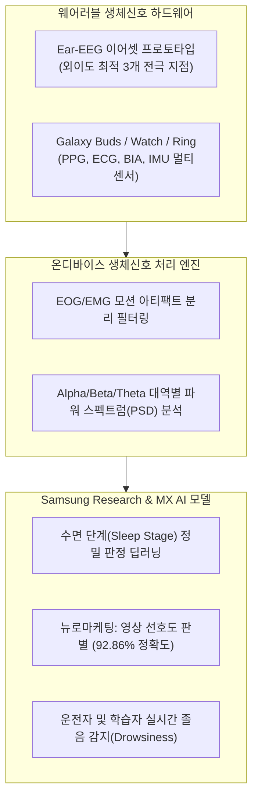

# [기업 실사 도시에] 삼성전자 주식회사 (Samsung Electronics Co., Ltd.)

> **실사 기준 일자**: 2026-09-19 (공시, 최신 IEEE 학술 논문 및 채용 포털 전수 실사)  
> **규격 준수**: [Rule: Deep-Tech Company Due-Diligence Protocol](file:///g:/My%20Drive/Kyubin_Yun_Workspace/04_Internship/.agents/rules/deep-tech-company-due-diligence.md) 6대 영역 24개 항목 전수 실사  
> **지원 대상 후보자**: 윤규빈 (Kyubin Yun) | UCL BSc Psychology and Language Sciences (Class of 2028, Penultimate Year)  
> **근무 자격 요건**: 대한민국 국적 보유자 및 대한민국 육군 병장 만기전역 (국내 취업 비자 제약 전무, 즉시 영구 Full-time 근무 가능)  
> **후보자 전형 적합도**: **최상 (★★★★★)** — 2027년 2~3월 접수되는 **'해외대 학부 하계 인턴십'** 지원 요건(2028년 6월 졸업 예정, 군필)에 100% 완벽 부합  

---

## 1. 기본 기업 개요 (Corporate Baseline)

* **정식 기업명**: 삼성전자 주식회사 (Samsung Electronics Co., Ltd.) | 법인 형태: 코스피 상장 대기업 (유가증권시장 005930)
* **대표이사**: **한종희 (부회장, DX부문장)** / **전영현 (부회장, DS부문장)**
* **설립 연월일**: **1969년 1월 13일** (업력 57년)
* **임직원 수**: **약 12만 5,000명** (국내 재직 인원 기준, 지속적인 R&D 인재 확충)
* **사업자등록번호**: `124-81-00998`
* **핵심 BCI / 생체신호 R&D 사업장 소재지**:
  * **서울 R&D 캠퍼스 (Samsung Research)**: 서울특별시 서초구 성촌길 56 (우면동)
  * **삼성디지털시티 (MX사업부 본부)**: 경기도 수원시 영통구 삼성로 129 (매탄동)
  * **SAIT (구 종합기술원)**: 경기도 수원시 영통구 삼성로 130 / 기흥캠퍼스
* **공식 웹사이트**: [https://www.samsung.com](https://www.samsung.com)
* **대표 연락처**:
  * 대표 전화: `02-2255-0114` (서초사옥) / `031-200-1114` (수원사업장)
  * 인재채용팀 공식 문의: `e.recruit@samsung.com`

---

## 2. 재무 및 투자 유치 현황 (Financials & Funding)

* **기업 규모 및 시가총액**: 코스피 시가총액 1위 (글로벌 탑티어 테크 엔터프라이즈)
* **자본금 규모**: 약 **8,975억 원**
* **연간 매출액 및 영업이익**: 연간 연결 매출 약 **258조~300조 원**, R&D 투자액 연간 **30조 원** 육박
* **뉴로테크 및 BCI 전략적 투자**:
  * **삼성벤처투자(SVIC)**를 통해 룩시드랩스(Looxid Labs), 뉴럴링크(Neuralink) 생태계, 국내외 바이오·디지털 헬스케어 딥테크에 선제적 지분 투자 집행.
  * 과기정통부 민관합동 **'BCI 얼라이언스'** 창립 멤버(산업계 대표)로 공식 참여.

---

## 3. 기술 아키텍처 및 BCI 프로덕트 (Core Tech & Products)

* **핵심 기술 및 최신 연구 성과**:
  1. **외이도 주변 뇌파 측정 디바이스 (Ear-EEG)**:
     * **주관 조직**: 삼성전자 MX사업부 Digital Health팀 (오은규 연구원 등) + 한양대학교 바이오메디컬공학과 임창환 교수 연구팀.
     * **연구 성과**: 기존 두피 뇌파계의 불편함을 해소하기 위해 귀 주변 11개 지점 신호를 전수 분석, **최적의 3개 지점**을 도출하여 일상 착용형 이어셋 시제품 개발.
     * **국제 공인**: 세계 최고 권위 학술지인 **『IEEE Sensors Journal』 (2025년)**에서 124편 중 **유일한 '대표 논문(Featured Paper)'**으로 선정.
     * **실증 데이터**: 영상 선호도 판별 정확도 **92.86%**, 실시간 졸음 감지 알고리즘 검증 완료.
  2. **Galaxy 생태계 멀티모달 생체신호 융합**:
     * Galaxy Watch, Ring, Buds에서 수집되는 심전도(ECG), 광혈류(PPG), 체성분(BIA), 뇌파(Ear-EEG) 신호를 On-Device AI로 결합하여 24시간 연속 멘탈 웰니스 및 신경계 모니터링 구축.
  3. **뉴럴링크(Neuralink) 4세대 칩 파운드리 제조 파트너십**:
     * 뇌 이식 칩을 구동하는 초저전력 서브마이크론 반도체 패키징 기술 공급.

---

## 4. R&D 조직 및 리서치 인텔리전스 (R&D Leadership & Network)

* **조직 구조 (3대 R&D 축)**:
  1. **Samsung Research (SR)** (서울R&D캠퍼스, 우면동):
     * DX부문 선행 연구 조직. AI Center, Data Intelligence Lab, Healthcare AI Lab 운영.
  2. **MX사업부 Digital Health팀** (수원 삼성디지털시티):
     * 상용 갤럭시 기기 탑재 생체신호 측정 알고리즘 및 BCI(Ear-EEG) 선행 상용화 연구.
  3. **SAIT (구 종합기술원)** (수원/기흥):
     * 미래 10년 뒤의 기술 연구. 'In and Near Sensor Computing', 뉴로모픽 칩 아키텍처 연구.
* **주요 연구 네트워크**:
  * 한양대학교 바이오메디컬공학과 (뇌-컴퓨터 인터페이스 국내 최고 권위 임창환 교수팀과 공식 산학 협력).
  * 삼성서울병원 신경과, 정신건강의학과와의 임상 데이터 검증 협업.

---

## 5. 채용 및 인턴십 운영 실사 (Recruitment & Internship Intelligence)

* **공식 채용 포털**: [삼성커리어스 (Samsung Careers)](https://www.samsungcareers.com)

### 5.1 해외대 학부 하계 인턴십 (★ 윤규빈 님 타깃 1순위 트랙)
* **모집 공고 명칭**: **해외대 학부 하계 인턴십 (Global Undergraduate Summer Internship)**
* **모집 주기 및 일정**:
  * **원서 접수**: **매년 2월 말 ~ 3월 초** (삼성커리어스 전용 공고 오픈)
  * **직무적합성평가 (서류)**: 3월 중순
  * **직무적성검사 (GSAT) 또는 SW 역량테스트**: 4월 중 (해외대생 대상 온라인 비대면 응시)
  * **비대면 화상 면접**: 5월 중 (직무역량 인터뷰 + 임원 인성 인터뷰)
  * **인턴십 실습**: **2027년 7월 초 ~ 8월 중순 (6주 실습)**
  * **전환 면접 및 최종 합격**: 8월 말 (실습 평가를 거쳐 **70~80%의 압도적인 정규직 전환율**)
* **지원 자격 요건**:
  * 해외 정규 대학 학부 재학생 중 **2027년 12월 ~ 2028년 8월 졸업 예정자** (**UCL 2028년 6월 졸업 예정인 윤규빈 님에게 완벽히 부합**).
  * 병역필 또는 면제자 (**대한민국 육군 병장 만기전역자 완벽 충족**).
  * 어학 자격: 해외대 학위 과정 중이므로 어학 성적 요건 면제 또는 자동 충족.
* **추천 지원 부문 및 직무**:
  * **DX부문 Samsung Research**: S/W개발 (AI Lab, Data Intelligence, Bio-signal Processing)
  * **DX부문 MX사업부**: S/W개발 (Digital Health 솔루션, 센서 신호처리 알고리즘)

### 5.2 전형 절차 상세 공략법
1. **1단계 서류 (직무에세이)**:
   * 단순 학점 나열이 아닌, '인지신경과학 전공 기반의 생체신호 데이터 분석 및 MNE-Python 파이프라인 경험'을 기술적 직무 적합성에 집중 기술.
2. **2단계 온라인 SW 역량테스트 or GSAT**:
   * S/W 직군 지원 시: 백준 골드 수준의 자료구조/알고리즘 (구현, DFS/BFS, 시뮬레이션 2문항, 3시간).
   * 데이터 분석/알고리즘 직군 지원 시: 비대면 온라인 GSAT (수리 20문항, 추리 30문항).
3. **3단계 비대면 화상 면접**:
   * 해외 현지(영국 런던)에서 온라인 접속하여 다대일 직무 면접(생체신호 프로젝트 질문) 및 임원 인성 면접 진행.

---

## 6. 윤규빈 님(UCL PALS) 1:1 맞춤 진입 전략 (Candidate Strategy)

### 6.1 전공 및 배경 매칭 포인트 (100% 매칭)
1. **학적 및 병역 자격의 완벽한 타이밍**:
   * 2027년 2~3월은 규빈 님이 UCL 2학년(Penultimate Year) 2학기이며, 2028년 6월 졸업 예정이므로 **삼성전자 해외대 하계 인턴십이 요구하는 '차년도 졸업 예정자' 기준에 오차 없이 일치**합니다.
   * 군필(병장 만기전역) 자격으로 남성 지원자 필수 관문을 무결점으로 통과합니다.
2. **Ear-EEG 연구 방향성과 인지신경과학의 결합**:
   * 삼성전자가 최근 발표한 Ear-EEG 연구의 핵심은 '영상 선호도(뉴로마케팅)'와 '주의집중/졸음'입니다.
   * UCL PALS에서 다루는 인지심리 평가 패러다임(인지부하, 주의집중 바이오마커)과 뇌파 신호처리 역량은 MX Digital Health팀 및 Samsung Research 면접관들에게 가장 차별화된 학문적 전문성을 제공합니다.

### 6.2 지원 준비 로드맵 (Action Timeline)
* **[2026년 10월 ~ 2027년 1월] SW 역량 및 뇌파 포트폴리오 자산화**:
  * 알고리즘 코딩테스트(Python/C++) 실전 풀이 (삼성 B형/골드 기출 유형).
  * MNE-Python 기반 뇌파 주파수 스펙트럼 분석 및 필터링 GitHub 레포지토리 구축.
* **[2027년 2월 초] 삼성커리어스 사전 모니터링**:
  * [삼성커리어스](https://www.samsungcareers.com) 회원가입 및 해외대 하계인턴 공고 알림 설정.
* **[2027년 2월 말 ~ 3월 초] 원서 접수**:
  * DX부문 Samsung Research 또는 MX사업부 S/W개발 직무로 영문/국문 성적표 첨부 지원서 제출.
* **[2027년 7월 ~ 8월] 하계 6주 실습 수행**:
  * 우면동 서울R&D캠퍼스 또는 수원 삼성디지털시티에서 실무 인턴십 수행 후 정규 3급 전환 오퍼 확보.
